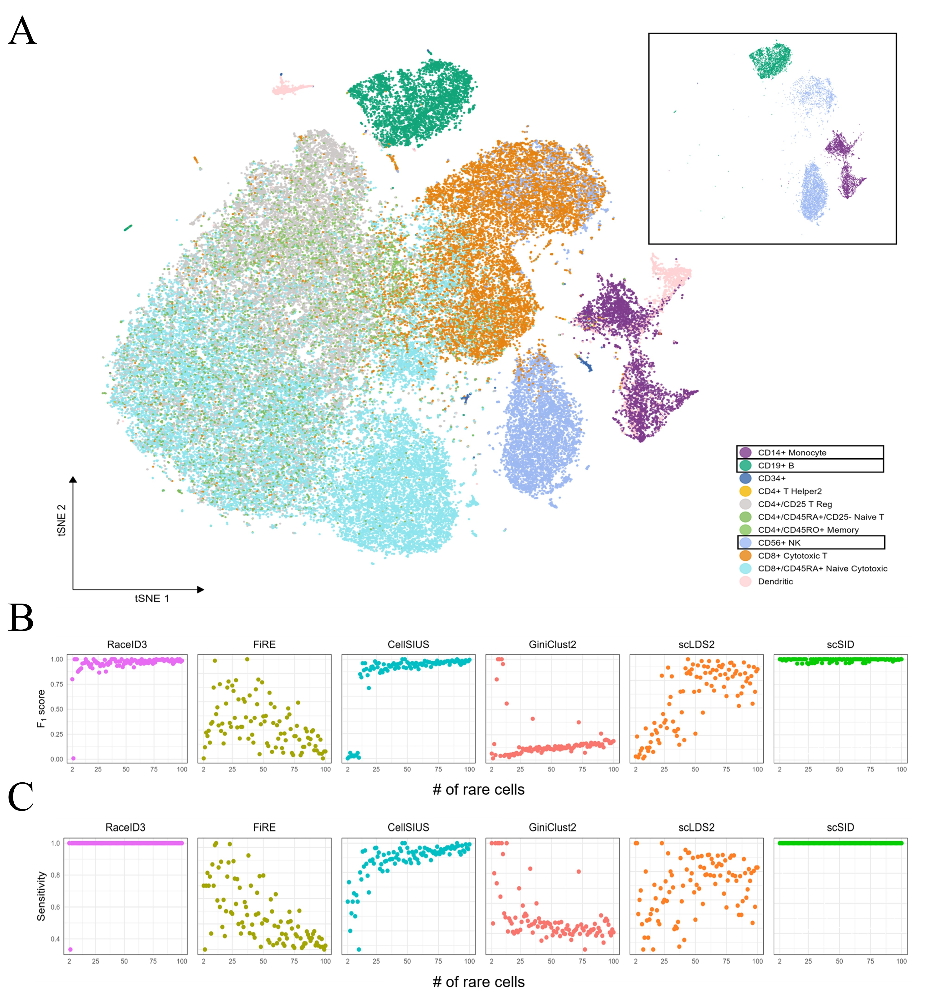

# scSID
# Full work will be provided in the future
## Single-Cell Similarity division for Identifying Rare Cells.
# Rare cell discovery

| Year | Title                                                        | Paper    |
| ---- | ------------------------------------------------------------ | -------- |
| 2024 | MarsGT: Multi-omics analysis for rare population inference using single-cell graph transformer | [paper](https://www.nature.com/articles/s41467-023-44570-8)|
| 2024 | Self-supervised deep clustering of single-cell RNA-seq data to hierarchically detect rare cell populations                         | [paper](https://academic.oup.com/bib/article/24/6/bbad335/7283019?searchresult=1)|
| 2024 | scNovel: a scalable deep learning-based network for novel rare cell discovery in single-cell transcriptomics  |[paper](https://doi.org/10.1093/bib/bbae112) |
| 2024 | scCross: efficient search for rare subpopulations across multiple single-cell samples | [paper](https://academic.oup.com/bioinformatics/advance-article/doi/10.1093/bioinformatics/btae371/7695870) |
| 2023 | CAKE: a flexible self-supervised framework for enhancing cell visualization, clustering and rare cell identification| [paper](https://doi.org/10.1093/bib/bbad475) |
| 2023| Sub-Cluster Identification through Semi-Supervised Optimization of Rare-Cell Silhouettes (SCISSORS) in single-cell RNA-sequencing                            | [paper](https://doi.org/10.1093/bioinformatics/btad449)        |
| 2023 | Rarity: discovering rare cell populations from single-cell imaging data | [paper](https://doi.org/10.1093/bioinformatics/btad750)|
| 2023 | A scalable unsupervised learning of scRNAseq data detects rare cells through integration of structure-preserving embedding, clustering and outlier detection | [paper](https://doi.org/10.1093/bib/bbad125)|
| 2023 | scMMT: a multi-use deep learning approach for cell annotation, protein prediction and embedding in single-cell RNA-seq data |[paper](https://academic.oup.com/bib/article/25/2/bbad523/7595618?searchresult=1#438455760)|
| 2023 | A multi-view latent variable model reveals cellular heterogeneity in complex tissues for paired multimodal single-cell data|[paper](https://doi.org/10.1093/bioinformatics/btad005)|
| 2022 | Learning discriminative and structural samples for rare cell types with deep generative model  | [paper](https://doi.org/10.1093/bib/bbac317) |
| 2021 | MicroCellClust: mining rare and highly specific subpopulations from single-cell expression data  | [paper](https://doi.org/10.1093/bioinformatics/btab239) |
| 2021 | Bayesian information sharing enhances detection of regulatory associations in rare cell types  | [paper](https://doi.org/10.1093/bioinformatics/btab269) |
| 2020 | GiniClust3: a fast and memory-efficient tool for rare cell type identification| [paper](https://link.springer.com/article/10.1186/s12859-020-3482-1) |
## Installation
### Required R modules
```
R >= 4.1.0
```
## Performance evaluation
  
  
  In terms of rare cell detection, scSID offers best performance compared with other methods.
  
 

Demo
----

Run:

```bash
data <- read.table(gzfile('/hpcfiles/users/pythonProjects/cell_identity/data/jurkat_two_species.txt.gz'))
result=scSID(data)
```
