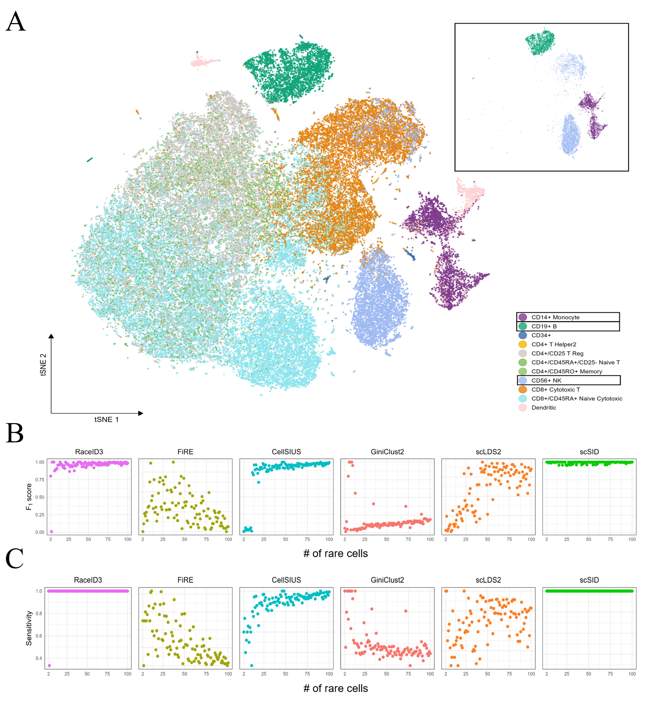
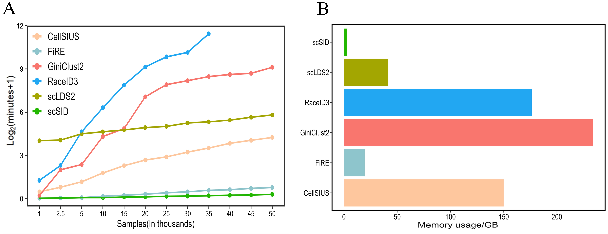

# scSID
## Full work will be provided in the future
## Single-Cell Similarity division for Identifying Rare Cells.

## Installation
### Required R modules
```
R >= 4.1.0
```
## Performance evaluation
  
  
  In terms of rare cell detection, scSID offers best performance compared with other methods.
  
  

As to compuation time and memory utilization, scSID also displays unrivaled speed and memory efficiency, in comparison with other methods.

Demo
----

Run:

```bash
data <- read.table(gzfile('/hpcfiles/users/pythonProjects/cell_identity/data/jurkat_two_species.txt.gz'))
result=scSID(data)
```
